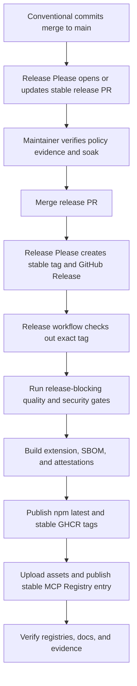

# Release Process

This document describes how the repository implements the channel, soak, validation, and recovery rules in the authoritative [Release Policy](RELEASE_POLICY.md). Release Please automates stable version bumps and release creation; numbered release candidates use an explicit manual path that cannot update stable moving tags.

## 1. Conventional Commits

We enforce the [Conventional Commits specification](https://www.conventionalcommits.org/). Version bumping is determined by the commit prefixes pushed to `main`:

| Commit prefix                     | SemVer bump | Description                                                               |
| --------------------------------- | ----------- | ------------------------------------------------------------------------- |
| `fix:`                            | Patch       | A backwards-compatible bug fix.                                           |
| `feat:`                           | Minor       | A backwards-compatible feature.                                           |
| `feat!:` or `BREAKING CHANGE:`    | Major       | A breaking public change with migration and deprecation evidence.         |
| `chore:`, `docs:`, `test:`, `ci:` | None        | Internal or documentation-only change unless release notes say otherwise. |

## 2. Channel mapping

| Channel    | Version/tag                                  | npm      | GitHub Release | GHCR                       | MCP Registry |
| ---------- | -------------------------------------------- | -------- | -------------- | -------------------------- | ------------ |
| Stable     | `X.Y.Z` / `easyeda-mcp-pro-vX.Y.Z`           | `latest` | non-prerelease | exact, `X.Y`, and `latest` | publish      |
| Prerelease | `X.Y.Z-rc.N` / `easyeda-mcp-pro-vX.Y.Z-rc.N` | `next`   | prerelease     | exact and `next`           | skip         |

Release Please remains stable-only (`prerelease: false`). Manual workflow dispatch validates that the supplied tag, requested channel, `package.json` version, public evidence URL, and GitHub Release classification all agree before publication.

## 3. Stable automation



The Release Please PR updates `package.json`, `.release-please-manifest.json`, `server.json`, `easyeda-bridge-extension/extension.json`, release-managed TypeScript version constants, plugin metadata, and `CHANGELOG.md`. Do not manually create the normal stable tag.

## 4. Prerelease automation

A prerelease is prepared in an ordinary reviewed candidate PR. The PR sets all release-managed versions to `X.Y.Z-rc.N`, updates release notes, and links the public evidence record. After merge:

```bash
TAG=easyeda-mcp-pro-vX.Y.Z-rc.N

git tag -a "$TAG" -m "$TAG"
git push origin "$TAG"
gh release create "$TAG" --verify-tag --prerelease --generate-notes
gh workflow run release-please.yml --ref "$TAG" \
  -f tag_name="$TAG" \
  -f release_channel=prerelease \
  -f evidence_url=https://github.com/oaslananka/easyeda-mcp-pro/issues/NUMBER
```

The workflow checks out the exact tag, verifies that the GitHub Release is non-draft and marked prerelease, reruns all gates, publishes npm with `--provenance --tag next`, publishes exact and `next` GHCR tags, uploads the extension and SBOM, and skips the MCP Registry.

## 5. Release-blocking gates

Both channels must pass:

- supported Node.js and pnpm runtime preflight;
- dependency audit and peer-dependency checks;
- Prettier, TypeScript server/extension typechecks, ESLint, tool metadata, and tool coverage checks;
- server tests and coverage plus extension tests and coverage;
- generated tool-reference drift check and documentation build;
- server build, extension build, extension distribution verification, and extension size budgets;
- Docker startup smoke, CodeQL, Semgrep, Sonar, Codecov, dependency review, workflow/container security, and required platform CI checks;
- SBOM generation, npm provenance, and GitHub artifact attestation.

The evidence record must also satisfy the soak and live EasyEDA validation rules in the Release Policy. Automation success alone does not waive those requirements.

## 6. Publication and verification

After a successful workflow:

1. verify the npm version and channel dist-tag;
2. verify GitHub Release draft/prerelease state and required assets;
3. verify extension checksums and artifact attestations;
4. verify exact and moving GHCR tags point to the expected digest;
5. verify the MCP Registry only for stable releases;
6. verify deployed documentation describes the released version and support claims;
7. publish the final evidence comment before announcing or closing the tracking issue.

See [Release Verification](RELEASE_VERIFICATION.md) for commands and [Release & CI Runbook](release-ci-runbook.md) for failure recovery.

## 7. Failed releases and emergency publication

For a transient failure, rerun only when the tag, commit, channel, and evidence are unchanged. A code, dependency, generated artifact, or release-metadata change requires a new version; never overwrite an immutable release.

Normal stable releases must use Release Please. A manual stable dispatch is reserved for the Emergency patch procedure in the Release Policy and requires an existing stable-format tag, a non-draft/non-prerelease GitHub Release, and a public evidence URL. The same quality, provenance, and registry checks still run.

If publication partially succeeds, stop promotion claims and follow the rollback/yanking sequence in the Release Policy. Keep tags, SBOMs, checksums, and attestations for auditability.
