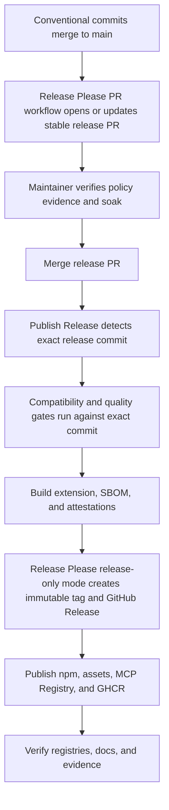

# Release Process

This document describes how the repository implements the channel, soak, validation, and recovery rules in the authoritative [Release Policy](RELEASE_POLICY.md). The **Release Please PR** workflow automates stable version bumps and changelog PRs; the separate **Publish Release** workflow owns gated immutable release creation and registry publication; numbered release candidates use an explicit manual path that cannot update stable moving tags.

## 1. Conventional Commits

We enforce the [Conventional Commits specification](https://www.conventionalcommits.org/). Version bumping is determined by the commit prefixes pushed to `main`:

| Commit prefix                     | SemVer bump | Description                                                               |
| --------------------------------- | ----------- | ------------------------------------------------------------------------- |
| `fix:`                            | Patch       | A backwards-compatible bug fix.                                           |
| `feat:`                           | Minor       | A backwards-compatible feature.                                           |
| `feat!:` or `BREAKING CHANGE:`    | Major       | A breaking public change with migration and deprecation evidence.         |
| `chore:`, `docs:`, `test:`, `ci:` | None        | Internal or documentation-only change unless release notes say otherwise. |

## 2. Channel mapping

| Channel    | Version/tag                                  | npm      | GitHub Release | GHCR                       | MCP Registry |
| ---------- | -------------------------------------------- | -------- | -------------- | -------------------------- | ------------ |
| Stable     | `X.Y.Z` / `easyeda-mcp-pro-vX.Y.Z`           | `latest` | non-prerelease | exact, `X.Y`, and `latest` | publish      |
| Prerelease | `X.Y.Z-rc.N` / `easyeda-mcp-pro-vX.Y.Z-rc.N` | `next`   | prerelease     | exact and `next`           | skip         |

Release Please remains stable-only (`prerelease: false`). The PR manager uses `skip-github-release: true`, so merging a release PR does not create a tag or GitHub Release until the Publish Release workflow has completed its pre-publication gates. Manual workflow dispatch validates that the supplied tag, requested channel, `package.json` version, public evidence URL, and GitHub Release classification all agree before publication.

## 3. Stable automation


```mermaid
graph TD
    A[Conventional commits merge to main] --> B[Release Please PR workflow opens or updates stable release PR]
    B --> C[Maintainer verifies policy evidence and soak]
    C --> D[Merge release PR]
    D --> E[Publish Release detects exact release commit]
    E --> F[Compatibility and quality gates run against exact commit]
    F --> G[Build extension, SBOM, and attestations]
    G --> H[Release Please release-only mode creates immutable tag and GitHub Release]
    H --> I[Publish npm, assets, MCP Registry, and GHCR]
    I --> J[Verify registries, docs, and evidence]
```

The Release Please PR updates `package.json`, `.release-please-manifest.json`, `server.json`, `easyeda-bridge-extension/extension.json`, release-managed TypeScript version constants, plugin metadata, and `CHANGELOG.md`. Do not manually create the normal stable tag. The automated gates finish **before the immutable tag and GitHub Release are created**.

## 4. Prerelease automation

A prerelease is prepared in an ordinary reviewed candidate PR. The PR sets all release-managed versions to `X.Y.Z-rc.N`, updates release notes, and links the public evidence record. After merge:

```bash
TAG=easyeda-mcp-pro-vX.Y.Z-rc.N

git tag -a "$TAG" -m "$TAG"
git push origin "$TAG"
gh release create "$TAG" --verify-tag --prerelease --generate-notes
gh workflow run publish-release.yml --ref main \
  -f tag_name="$TAG" \
  -f release_channel=prerelease \
  -f evidence_url=https://github.com/oaslananka/easyeda-mcp-pro/issues/NUMBER
```

The Publish Release workflow checks out the exact tag, verifies that the GitHub Release is non-draft and marked prerelease, reruns all gates, publishes npm with `--provenance --tag next`, publishes exact and `next` GHCR tags, uploads the extension and SBOM, and skips the MCP Registry.

## 5. Release-blocking gates

Before publication begins, `pnpm release:readiness:compatibility` must confirm that at least one live
EasyEDA record is current for the exact candidate commit. The release workflow runs this command
after runtime and dependency installation and before the remaining quality gates. Any later change
under the configured compatibility-sensitive paths makes older evidence stale and blocks both stable
and prerelease publication until a new disposable-project live run is recorded.

Both channels must pass:

- supported Node.js and pnpm runtime preflight;
- dependency audit and peer-dependency checks;
- Prettier, TypeScript server/extension typechecks, ESLint, tool metadata, and tool coverage checks;
- server tests and coverage plus extension tests and coverage;
- generated tool-reference drift check and documentation build;
- server build, extension build, extension distribution verification, and extension size budgets;
- Docker loopback, fail-closed, and published-host-port smoke; CodeQL; Semgrep; Sonar; Codecov; dependency review; workflow/container security; and required platform CI checks;
- SBOM generation, npm provenance, and GitHub artifact attestation. The npm path uses npm Trusted Publishing. For first publication, new npm versions use Trusted Publishing without `NPM_TOKEN`; `NPM_TOKEN` is restricted to existing-version dist-tag recovery.

The evidence record must also satisfy the soak and live EasyEDA validation rules in the Release Policy. Automation success alone does not waive those requirements. The full local convenience command is `pnpm release:readiness`; it intentionally fails before the expensive quality sequence when the compatibility evidence is stale.

## 6. Publication and verification

After a successful workflow:

1. verify the npm version and channel dist-tag;
2. verify GitHub Release draft/prerelease state and required assets;
3. verify extension checksums and artifact attestations;
4. verify exact and moving GHCR tags point to the expected digest;
5. verify the MCP Registry only for stable releases;
6. verify deployed documentation describes the released version and support claims;
7. require the **Verify published release** workflow step to pass and archive `published-release.json`;
8. publish the final evidence comment before announcing or closing the tracking issue.

See [Release Verification](RELEASE_VERIFICATION.md) for commands and [Release & CI Runbook](release-ci-runbook.md) for failure recovery.

## 7. Failed releases and emergency publication

For a transient failure, rerun only when the tag, commit, channel, and evidence are unchanged. A code, dependency, generated artifact, or release-metadata change requires a new version; never overwrite an immutable release.

Normal stable releases must use Release Please. A manual stable dispatch is reserved for the Emergency patch procedure in the Release Policy and requires an existing stable-format tag, a non-draft/non-prerelease GitHub Release, and a public evidence URL. The same quality, provenance, and registry checks still run.

If publication partially succeeds, stop promotion claims and follow the rollback/yanking sequence in the Release Policy plus the registry-specific procedures in [Solo-maintainer continuity and release recovery](SOLO_MAINTAINER_RECOVERY.md). Keep immutable tags, SBOMs, checksums, attestations, and the public evidence issue for auditability. Manual recovery runs use the current workflow policy from `main` and then build the immutable requested tag.
